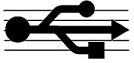
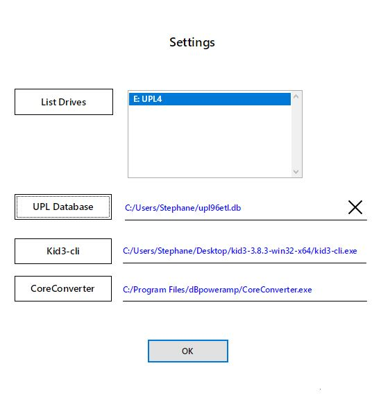
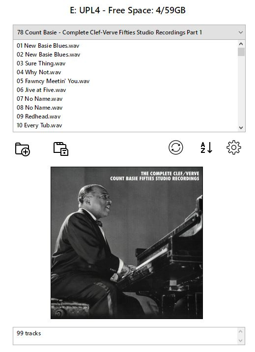

## Purpose

The **UPL96ETL** by ECDesigns is a high fidelity audio source that plays music files stored on USB keys.

https://www.ecdesigns.nl/en/blog/upl96etl

Music files must comply with the following formats:

- files are stored in folders whose first two digits must be 01 to 99
- file names must also start with 01 to 99
- files must be in WAV format, with id3v2 tags only
- id3v2 tags should contain at minimum the artist, album, title, track number
- tags can contain album cover art, preferably in small size to avoid lengthy updates when a key is inserted in the player

The program in this repository is designed to *assist* in copying your music files to USB keys in a format compatible with the use of the UPL96ETL. It is written with Livecode community edition (open source), and runs on **Windows** but could be adapted to other operating systems.

## Prerequisites

The following programs must be installed on your computer: Kid3 (music tagger) and dBpoweramp Music Converter (audio file conversion)

https://kid3.kde.org/
    
https://www.dbpoweramp.com/dmc.htm

## Download

Download the following zip file and extract it to your computer. Run the application "Launcher.exe"

**[UPL Accessory.zip](https://storage.cloud.google.com/cloudplayer/UPL_Accessory/UPL%20Accessory.zip)**

## Operation

On startup, the settings card is displayed:

- click on "List Drives" to refresh the list of removeable media and select one in the list
- optionally locate the database file "upl96etl.db" by clicking on "UPL Database". 
- locate the program file "Kid3-cli.exe" on your computer by clicking on "Kid3-cli"
- locate the program "CoreConverter.exe" on your computer by clicking on "CoreConverter"

Only removeable drives with a label are displayed. The program will only update drives that contain a file "id.txt" in the root folder.

Note: the database file is used by the ECDesigns application to display the content of the keys (https://www.ecdesigns.nl/en/blog/uplremote-software).
If the database file is entered above, the USB key will be removed from the database when adding new folders - this will trigger an automatic update of the database when the key is inserted back into the UPL96ETL.

Click on "OK" to display the second card.

**Existing folders with a 2 digit prefix (01 to 99) are automatically re-numbered sequentially from 01 to 99 each time the content of the key is displayed (or the Refresh button is clicked). Other folders are left unchanged.**

Folder (01 to 99) content can be displayed using the pull-down menu. The last folder of the USB key is displayed initially.

Click on the first icon (folder with + sign) to **add a new folder** to the USB key.

To **add tracks**:

- drag a folder with your music from the Windows file explorer into the track list box
- or alternatively drag a playlist file (.M3U)

Folders are recursively scanned to display music files. A maximum of 99 tracks can be copied to each folder. The following file extensions are taken into account: flac,wav,aiff,aif,m4a,ape,ogg.

If the folder contains a file "folder.jpg" in its root, the image will be automatically resized to 300x300 pixels and displayed in the thumbnails box. Alternatively, an image can be dragged from the file explorer into the thumbnails box.

The new folder will be automatically renamed to correspond to the windows foldername or the playlist filename.

Click on the second icon (folder with disk) to **save the files** to the USB key. 

The files are converted to WAV, and tags are added:

- **artist** is copied from the artist tag or the album artist tag (if the artist tag is empty) of the source file. If both the artist and album artist tags are empty in the sourcefile, then the tracks copied on the USB key will contain the value "artist" 
- **album** is copied from the album tag of the source file - if there is no album tag, then the tracks copied on the USB key will contain the value "album" 
- **title** is either copied from the title tag of the original file, or the filename if no title tag is defined
- **tracknumbers** are incremented sequentially in the order of the files displayed

Leading and trailing whitespaces are removed from the tags.

The resized image is only copied into the tags of the first track of each folder, thereby ensuring that the USB key will be read quickly when inserting it back in the UPL96ETL.

The image is also copied to the corresponding USB drive folder, which is not useful for the operation of the UPL96ETL but allows displaying the artwork of each folder when running the ULP Accessory. 

Any error messages during the conversion will interrupt the copy. Error messages are displayed in the message box at the bottom of the screen.

The list of folders can be **refreshed** by clicking on the third icon. Any tracks or images added but not yet saved will be lost.

The fourth icon can be used to sort and rename the folders of the UBS Key **alphabetically**.

The **settings** screen can be accessed by clicking on the last icon.

Removing or renaming a folder must be done in the file explorer.

Happy Listening.
