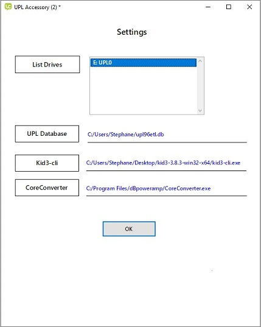
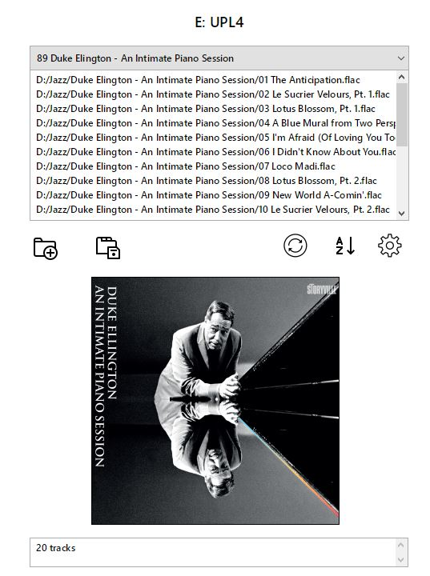

## Purpose

The **UPL96ETL** by ECDesigns is a high fidelity audio source that plays music files stored on USB keys.

https://www.ecdesigns.nl/en/blog/upl96etl

Music files must comply with the following formats:

- files are stored in folders whose first two digits must be 01 to 99
- file names must also start with 01 to 99
- files must be in WAV format, with id3v2 tags only
- id3v2 tags should contain at minimum the artist, album, title, track number
- first file of each folder can contain an image (album cover art, preferably in small format)

The program in this repository is designed to *assist* in copying your music files to USB keys in a format compatible with the use of the UPL96ETL. It is written with Livecode community edition (open source), and runs on **Windows** but could be adapted to other operating systems.

## Prerequisites

The following programs must be installed on your computer: Kid3 (music tagger) and dBpoweramp Music Converter (audio file conversion)

https://kid3.kde.org/
    
https://www.dbpoweramp.com/dmc.htm

## Operation

On startup, the settings card is displayed:

- click on "List Drives" to refresh the list of removeable media and select one in the list
- optionally locate the database file "upl96etl.db" by clicking on "UPL Database". 
- locate the program file "Kid3-cli.exe" on your computer by clicking on "Kid3-cli"
- locate the program "CoreConverter.exe" on your computer by clicking on "CoreConverter"

Only removeable drives with a label are displayed. The program will only update the content of these drives if there is a file "id.txt" in the root.

Note: the database file is used by the ECDesigns application (https://www.ecdesigns.nl/en/blog/uplremote-software) to display the content of the keys.
If the database file is entered above, the USB key will be removed from the database when adding new folders - this will trigger an automatic update of the database when the key is inserted into the UPL96ETL.

Click on "OK" to display the second card.

**Existing folders with a 2 digit prefix (01 to 99) are automatically re-numbered sequentially from 01 to 99 each time the content of the key is displayed (or the Refresh button is clicked). Other folders are left unchanged.**

Click on the second icon (folder with + sign) to **add a new folder** to the USB key.

To **add tracks**:

- drag a folder with your music from the Windows file explorer into the track list box
- or alternatively drag a playlist file (.M3U)

Folders are recursively scanned to display all WAV and FLAC files. A maximum of 99 tracks can be copied to each folder.

If the folder contains a file "folder.jpg" in its root, the image will be automatically resized to 300x300 pixels and displayed in the thumbnails box. Alternatively, an image can be dragged from the file explorer into the thumbnails box.

The new folder will be automatically renamed to correspond to the windows foldername or the playlist filename.

Click on the third icon (folder with disk) to **save the files** to the USB key. The files are converted to WAV, and tags are added:

- **artist** is copied from the artist tag or the album artist tag (if the artist tag is empty) of the source file. If both the artist and album artist tags are empty in the sourcefile, the value "artist" will be used
- **album** is compied from the album tag of the source file, or "album" if the album tag is empty
- **title** is either the title tag of the original file, or the filename if no title tag is defined
- **tracknumbers** are incremented sequentially in the order of the files displayed

Leading and trailing whitespaces are removed from the tags.

Any error messages during the conversion will interrupt the copy. Error messages are displayed in the message box at the bottom of the screen.

Removing or renaming a folder must be done in the file explorer.

The list of folders can be **refreshed** by clicking on the third icon. Any tracks or images added but not yet saved will be lost.

The settings screen can be accessed by clicking on the fourth icon.

Happy Listening.
